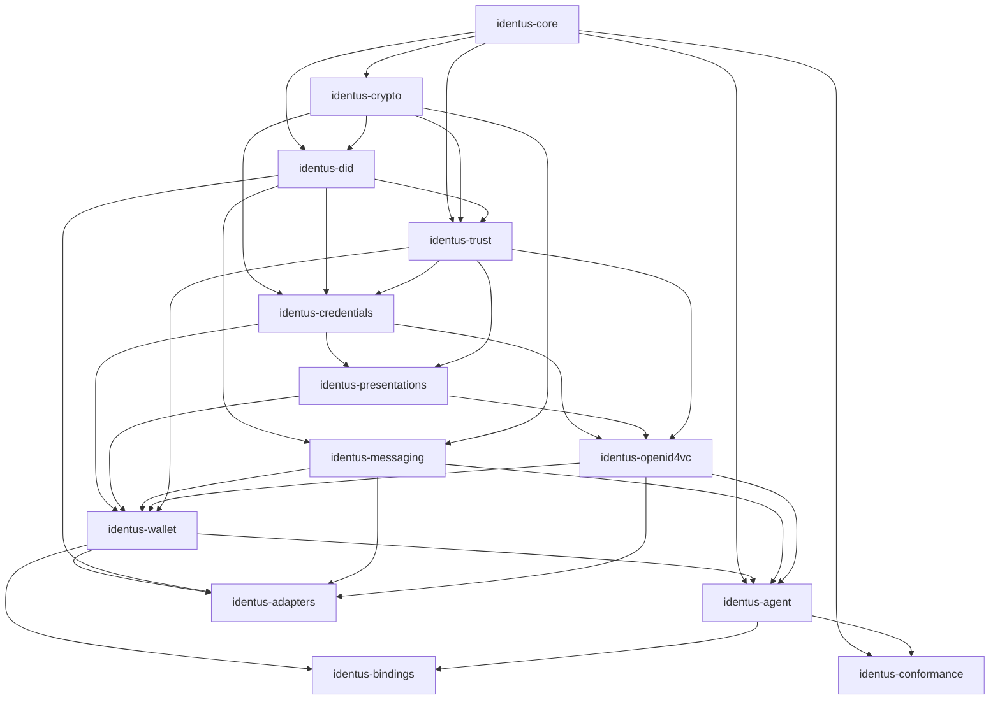

# ADR: Crate Layout And Dependency Rings

Status: Accepted

Date: 2026-06-13

## Context

`sdk-rust` is a monorepo that must replace duplicated SDK logic, host reusable
SSI primitives, support wrappers for other languages, and later provide shared
core crates for Rust service ports. The workspace needs stable crate rings so
new work can be added without creating circular dependencies, platform leakage,
or wrapper-owned semantics.

## Decision

The workspace uses these dependency rings:

| Ring | Crates | Rule |
|---|---|---|
| Foundation | `identus-core` | Shared DTOs, metadata, fixture contracts, and error conventions. No platform, protocol, storage, or binding dependencies. |
| Cryptography | `identus-crypto` | Key, signer, hash, JOSE/COSE, and crypto policy primitives. Depends inward on `identus-core`. |
| Identity | `identus-did`, `identus-trust` | DID, DID URL, resolver ports, trust anchors, status policy, and trust-chain primitives. Depends only on foundation and cryptography rings. |
| Credential And Presentation | `identus-credentials`, `identus-presentations` | Credential formats, verification, status use, presentation requests, selection, and disclosure. Depends on identity and trust rings. |
| Protocol | `identus-messaging`, `identus-openid4vc` | DIDComm, mediation, pickup, OID4VCI, OID4VP, SIOPv2, HAIP, and protocol state machines. Depends on typed domain ports, not platform adapters. |
| Wallet And Agent | `identus-wallet`, `identus-agent` | Wallet records, backup/restore, local orchestration, and lightweight issuer/holder/verifier/peer harnesses. Depends on domain and protocol crates through ports. |
| Adapters | `identus-adapters` | HTTP, SQLite, secure storage, VDR, signer, KMS, DIDComm transport, proximity, browser, mobile, and service adapters. May depend on ports and DTO crates; domain crates must not depend on adapters. |
| Bindings | `identus-bindings` | WASM, Node/N-API, UniFFI, Swift, Kotlin, TypeScript, React, and React Native DTO and error surfaces. May depend on stable facade crates, not own product semantics. |
| Conformance | `identus-conformance` | Specification catalog, fixture validation, migration inventories, and architecture guards. It may depend on crates needed to validate public contracts, but production crates must not depend on it. |

## Dependency Diagram

## Crate Addition Rules

- New domain crates must enter a ring before code lands.
- Domain crates must not depend on `identus-adapters`, `identus-bindings`, or
  service binaries.
- Adapter crates must implement explicit ports and use feature gates for heavy
  dependencies, external services, databases, and mobile/browser targets.
- Binding crates must expose DTOs, opaque handles, typed errors, and generated
  facade code. They must not implement credential, DID, messaging, OpenID4VC,
  trust, storage, or wallet semantics independently.
- Conformance fixtures must be added before claiming support for a
  specification, adapter, wrapper, or service capability.
- Optional infrastructure must have a Docker-free vector, transcript, or
  in-memory alternative whenever practical.
- Crates that introduce `unsafe`, raw key export, network I/O, filesystem I/O,
  database access, or FFI boundaries require an ADR or task acceptance criteria
  that explains the boundary and validation.

## Package Layout Rules

- `crates/<name>/src/lib.rs` is the public Rust entry point for each crate.
- `fixtures/conformance/` stores checked-in behavior and migration evidence.
- `fixtures/schema/` stores machine-readable fixture schemas.
- `docs/architecture/` stores ADRs and component relations.
- `docs/testing/` stores runner contracts, fixture policy, and BDD inventories.
- `docs/migration/` stores legacy SDK and service migration evidence.
- `tools/` stores deterministic generation and validation scripts used by
  conformance or CI.

## Future Split Rules

Crates may split only when one of these is true:

- A feature needs a materially different release cadence or optional dependency
  surface.
- A platform adapter would otherwise leak into a domain crate.
- A wrapper target requires generated artifacts that should not affect core
  crate builds.
- A service port needs a thin binary crate over reusable SDK crates.

Crates should not split only to mirror historical SDK module names.

## Consequences

- Cargo dependency direction remains reviewable.
- Feature gates and adapter boundaries are part of the architecture, not
  after-the-fact cleanup.
- Wrappers can ship ergonomic APIs while the Rust core remains the semantic
  owner.
- Future Mediator, Cloud-Service, and NeoPRISM service ports can become thin
  service crates over the same reusable modules.
