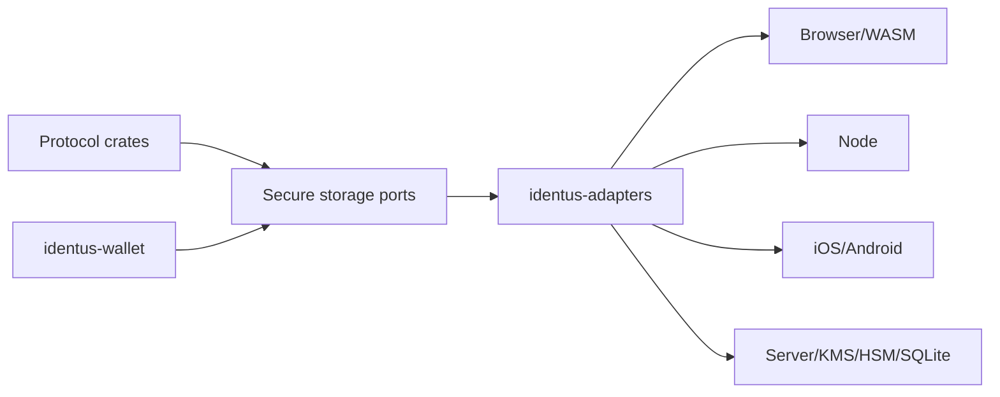

# ADR: Platform Secure Storage Boundary

**Status**: Accepted

**Date**: 2026-06-13

## Context

`sdk-rust` is intended to be the shared core for server, browser, Node, iOS,
Android, JVM, WASM, and UniFFI wrappers. Credential wallets, DID keys,
DIDComm secrets, OpenID4VC proof keys, mediator routing secrets, backups, and
trust material must not be handled differently by each wrapper.

Existing SDKs expose platform storage behavior through language-specific
surfaces. The Rust core needs a portable boundary before wrapper APIs stabilize,
otherwise TypeScript, Swift, Kotlin, and service ports will duplicate security
semantics.

## Decision

`sdk-rust` will define secure storage as an adapter boundary, not as protocol
business logic. Core crates may request storage through typed ports, but they
must not directly depend on browser, mobile, server, operating-system, or cloud
secret-store APIs.

The storage boundary is owned by `identus-wallet` and `identus-adapters`.
Protocol crates may depend on traits and typed handles, never raw platform
stores.

## Secret Classes

Storage APIs must classify data before persistence:

| Class | Examples | Handling |
|---|---|---|
| `PublicMetadata` | DID documents, credential schema refs, public status refs | Plain storage is allowed when integrity is checked. |
| `PrivateMetadata` | Wallet labels, pairwise routing metadata, mediator account ids | Encrypt at rest when a platform key is available. |
| `CredentialPayload` | Verifiable credentials, presentations, disclosure records | Encrypt at rest and bind to wallet scope. |
| `KeyMaterial` | DID private keys, DIDComm secrets, OpenID4VC proof keys | Non-exporting handles by default; export requires explicit capability. |
| `RecoveryMaterial` | Backup seeds, recovery shares, deterministic DID seed material | Strongest available platform protection plus explicit backup policy. |

## Ports

The first stable storage boundary must expose typed ports equivalent to:

- `SecureStore`: namespaced get, put, delete, list, and compare-and-swap for
  encrypted records.
- `KeyStore`: generate, import public test vectors, sign, key agreement, and
  delete through non-exporting key handles.
- `SecretResolver`: resolve DIDComm and OpenID4VC secret handles without
  exposing raw private keys.
- `BackupStore`: export and import encrypted wallet snapshots with policy
  metadata and versioned manifests.
- `EntropySource`: injectable randomness for deterministic tests and platform
  randomness for production.

Every port must use typed identifiers, typed errors, zero-copy avoidance for
secret bytes where practical, and redaction-safe diagnostics.

## Platform Adapter Requirements

| Platform | Required adapter behavior |
|---|---|
| Browser/WASM | Use WebCrypto for crypto operations where available, IndexedDB for encrypted records, and feature-gate any fallback that weakens key protection. |
| Node | Use OS keychain or explicit file-backed encrypted store; never silently fall back to plaintext secrets. |
| iOS | Use Keychain or Secure Enclave-backed keys when available; records remain scoped to app group policy chosen by the wrapper. |
| Android | Use Android Keystore for keys and encrypted storage for records; biometric gating is an adapter option, not a core requirement. |
| JVM | Use platform keystore where available, with explicit server/JVM fallback configuration. |
| Server | Support memory, SQLite, file, HSM/KMS, and cloud secret-manager adapters behind features; plaintext file secrets are test-only. |

## Safety Rules

- Raw private keys must not cross public Rust, UniFFI, WASM, Node, Swift, or
  Kotlin wrapper boundaries unless the caller requests an explicit export
  capability and the adapter marks the key exportable.
- Logging, errors, metrics, spans, and panic messages must redact secrets,
  credential claims, bearer tokens, backup material, and private metadata.
- Storage records must carry version, owner crate, namespace, secret class,
  key id or encryption profile, and migration metadata.
- Default tests must use deterministic in-memory adapters only.
- Infrastructure tests may exercise SQLite, OS keychain, device keystore,
  HSM/KMS, cloud secret managers, or browser storage, but they must be opt-in.
- Backup and restore must be verified without production secrets before any
  wrapper claims migration parity.

## Architecture

Protocol crates depend inward on typed ports. Adapter crates own platform
integration and feature gates.

## Conformance

`identus-conformance` must track secure-storage coverage before wrapper APIs
stabilize:

- Static model tests for secret-class metadata and redaction-safe errors.
- Vector tests for backup manifest format and migration metadata.
- Transcript or acceptance tests for backup and restore across issuer, holder,
  verifier, and peer roles.
- Infrastructure tests for browser, Node, iOS, Android, JVM, SQLite, HSM/KMS,
  and cloud secret-manager adapters when those targets become available.

## Consequences

- Bindings can expose stable wallet and key handles without duplicating storage
  policy per language.
- Server, mobile, and web adapters can evolve independently behind feature
  gates.
- The default test path remains Docker-free and device-free.
- Additional implementation work is required before wrappers can claim secure
  storage parity.
