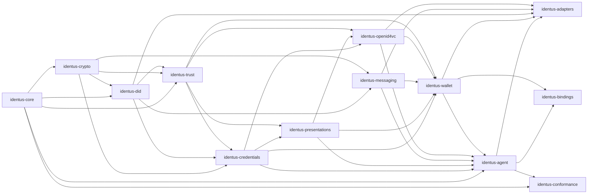
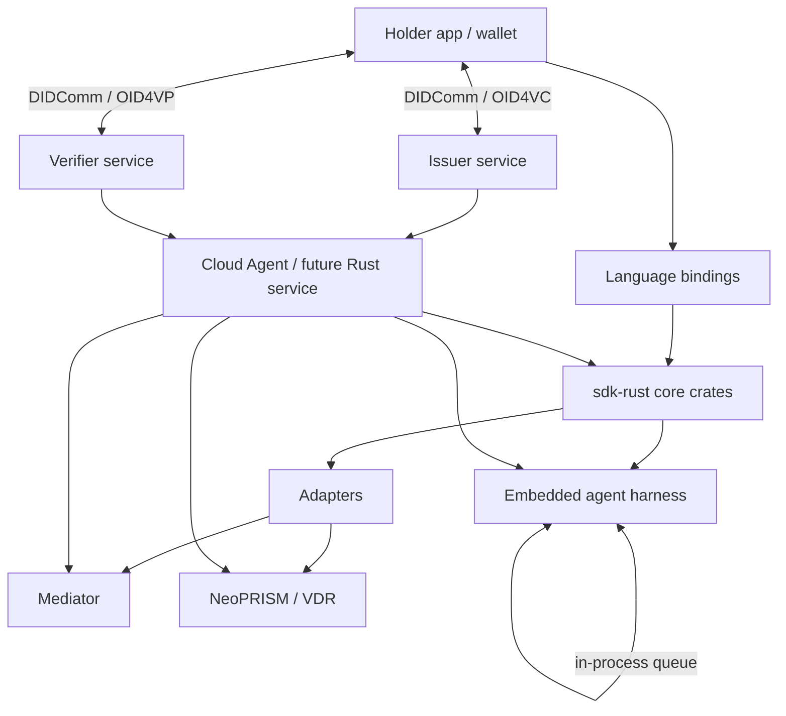
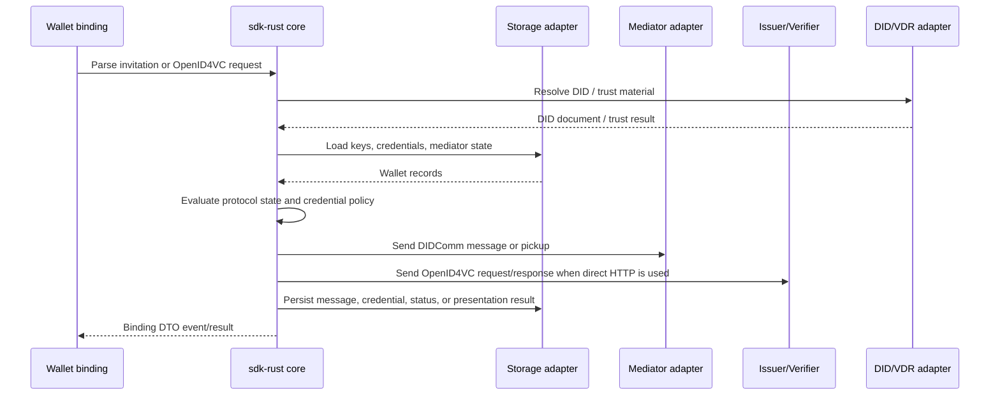

# Component Architecture

This document records the phase-1 component model for `sdk-rust`. The crates are
compile-only boundaries in this phase; production protocol logic belongs in later
phases after fixtures and conformance sources are attached.

For the exact current Cargo dependency graph, see
[`current-workspace.md`](current-workspace.md). This document includes intended
component relations and runtime relations, while `current-workspace.md` records
the manifest-derived crate graph.

## Components

| Component | Crate | Responsibility | Legacy source capability |
|---|---|---|---|
| Core | `identus-core` | Shared DTOs, errors, fixture contracts, component metadata, observability primitives | Shared domain models |
| Crypto | `identus-crypto` | Keys, signatures, encryption, JOSE/COSE, signer abstraction, hardware/KMS ports | Legacy SDK cryptography modules |
| DID | `identus-did` | DID Core, DID URL, `did:prism`, `did:peer`, DID document and resolver ports | Legacy SDK DID modules, neoprism DID crates |
| Trust | `identus-trust` | Trust anchors, policy, OpenID Federation, X.509/IACA roots, status trust, wallet attestations | Cloud Agent trust policy, EUDI/HAIP gap |
| Credentials | `identus-credentials` | Credential models and verification for W3C VC, JWT VC, SD-JWT VC, AnonCreds, OpenBadges, mdoc | Legacy SDK credential modules |
| Presentations | `identus-presentations` | Presentation Exchange, DCQL, selection, disclosure frames, VP validation | Legacy SDK presentation and DIF plugin modules |
| Messaging | `identus-messaging` | DIDComm v2, OOB, issue credential, present proof, mediation, pickup, forwarding | Legacy SDK messaging modules, Mediator |
| OpenID4VC | `identus-openid4vc` | OID4VCI, OID4VP, SIOPv2, HAIP, request URI and direct_post flows | sdk-ts OIDC plugin, Cloud Agent OID4VCI |
| Wallet | `identus-wallet` | Wallet records, storage ports, backup/restore, agent orchestration, mediator state | Legacy SDK wallet and agent orchestration modules |
| Agent | `identus-agent` | Lightweight issuer, holder, verifier, peer, and embedded mediator acceptance-test model | Cloud Agent, legacy holder SDK test harness, Mediator |
| Conformance | `identus-conformance` | Specification catalog, owner mapping, conformance modes, and test boundaries | Identus docs, Cloud Agent and SDK BDD suites, integration matrix |
| Adapters | `identus-adapters` | HTTP, SQLite, secure storage, neoprism VDR, KMS, DIDComm transport, BLE/NFC/QR adapters | Platform-specific SDK code |
| Bindings | `identus-bindings` | Stable DTOs and error surfaces for WASM, Node, UniFFI, Swift, Kotlin, TypeScript | sdk-ts, sdk-swift, sdk-kmp wrappers |

## Dependency Direction

Domain crates depend inward. Adapters and bindings depend on ports and DTOs, not
the other way around.

## Runtime Relations

## Protocol Flow Ownership

## Docs-Derived Specification Baseline

The docs repository currently lists these Identus-relevant specifications:

- DIDComm Messaging v2.x, OOB 2.0, BasicMessage 2.0, Coordinate Mediation
  2.0/3.0, Message Pickup 3.0, Trust Ping 2.0, Report Problem 2.0, Routing 2.0.
- W3C DID Core, PRISM DID Method, Peer DID 1.0 with `did:peer:2` fully
  supported today.
- W3C VC JSON Schema, JOSE/COSE for VCs, JOSE registry, SD-JWT, SD-JWT VC,
  AnonCreds v1.0, DID:PRISM AnonCreds method, HTTP AnonCreds method,
  Bitstring Status List v1.0.
- Issue Credential 3.0, Present Proof 3.0, Identus Revocation Notification
  1.0, OID4VCI, and OID4VP.

The docs also show product relations that must stay visible in `sdk-rust`:

- Cloud Agent owns server-side issuing, verification, DID management,
  multi-tenancy, REST APIs, and future Rust service reuse.
- Wallet SDKs own holder-side storage, presentations, secure key management,
  DIDComm messaging, and mobile/web bindings.
- Mediator owns routing, queued delivery, offline wallet support, and privacy
  preserving forwarding.
- NeoPRISM is the Rust VDR backend for PRISM DID resolution, indexing, and
  operation submission.
- Existing BDD suites in `cloud-agent`, `sdk-ts`, and `sdk-kmp` define the
  first acceptance-test corpus. The grouped inventory is recorded in
  `docs/testing/bdd-scenarios.md`.
- DID method support and dependency candidates are recorded in
  `docs/architecture/did-methods.md`.
- DIDComm protocol support, compatibility aliases, typed message boundaries, and
  base crate candidates are recorded in
  `docs/architecture/didcomm-protocols.md`.

## Phase-1 Outcome

Phase 1 delivers this compile-only workspace and architecture map. Phase 2 can
now deepen fixture schemas and migration gates without changing the component
boundaries. The legacy migration matrix maps sdk-ts, sdk-swift, sdk-kmp, and
neoprism modules to Rust owner crates, wrapper targets, parity proofs, and
follow-up ADRs in `docs/migration/legacy-sdk-map.md`.

## Acceptance-Test Harness Outcome

`identus-agent` adds the first executable acceptance-test model. It is not
production protocol code; it models issuer, holder, verifier, peer, and embedded
mediator behavior with in-process queues so BDD scenarios can be ported before
Docker-backed services are required.

`identus-conformance` adds the first executable specification catalog. Every
planned supported standard must have an owner crate, source URI, conformance
mode, support stage, and backlog task before implementation can claim support.
