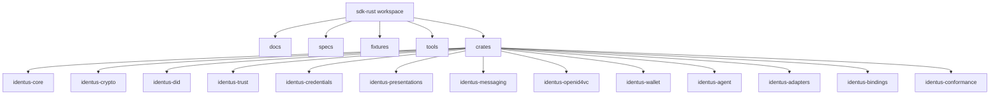
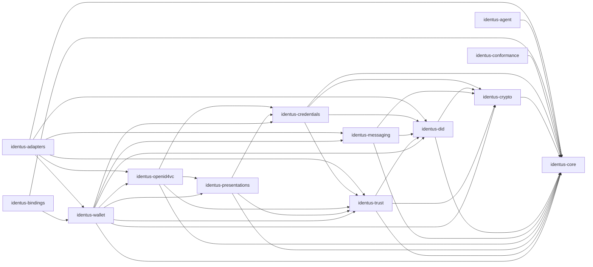
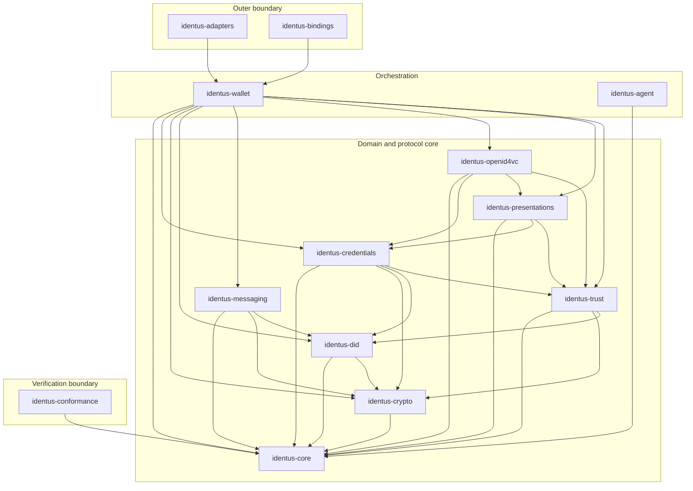

# Current Workspace Architecture

This document describes the current `sdk-rust` repository layout and actual
Cargo dependencies between crates. It is a snapshot of the committed workspace,
not a target-state roadmap. The machine-readable evidence is stored in
`fixtures/conformance/static-model/workspace-dependency-graph.json` and checked
with `node tools/generate-workspace-dependency-graph.mjs --check`. The fixture
also records allowed production target layers and must report zero production
policy violations and zero production dependency cycles.

## Workspace Shape

The repository is a Rust workspace with thirteen library crates. The current
implementation is intentionally metadata-first: most crates define stable module
boundaries, component metadata, and early type-safe surfaces while conformance
fixtures and acceptance tests drive the next implementation increments.

## Crate Responsibilities

| Crate | Current responsibility | Current implementation depth |
|---|---|---|
| `identus-core` | Shared component metadata, typed error codes, redaction-safe errors, result envelopes, and future DTO/observability primitives. | Component metadata plus initial core error/result conventions and tests. |
| `identus-crypto` | Cryptography, keys, signer abstraction, key-management ports, JOSE/COSE, KMS and hardware signer boundaries. | Boundary crate with component metadata. |
| `identus-did` | Type-safe DID and DID URL parsing, DID method classification, DID method support profiles, and core typed error mapping. | Implemented parser/model tests plus redaction-safe core error conversion for DID parser failures. |
| `identus-trust` | Trust anchors, federation, attestations, status, and verifier policy boundaries. | Typed status, anchor, chain, policy, and evidence-store ports with Docker-free in-memory trust registry fixtures. |
| `identus-credentials` | Credential format models, issuance, verification, status-aware credential validation. | Format-neutral credential descriptor and static format registry plus trust-policy delegation and Docker-free negative verification replay. |
| `identus-presentations` | Presentation request, credential selection, disclosure, exchange, and verification boundaries. | Trust-policy delegation hook plus Docker-free negative verification replay for audience, domain, challenge, holder-binding, and disclosure failures. |
| `identus-messaging` | DIDComm v2, protocol profiles, message type parsing, addressed message primitives, mediator boundaries, and core typed error mapping. | Implemented message type, protocol catalog, addressing tests, redaction-safe core error conversion, and Docker-free state-machine replay for credential, proof, problem, trust-ping, revocation, mediation, pickup, and routing flows. |
| `identus-openid4vc` | OID4VCI, OID4VP, SIOPv2, HAIP, federation, request URI, and direct_post boundaries. | Federation trust-policy delegation hook, Docker-free transcript replay, stateful OID4VCI issuance transitions, and OID4VP/SIOPv2 presentation transitions for same-device, cross-device, and self-issued ID token flows. |
| `identus-wallet` | Wallet records, storage ports, backup, agent orchestration, credential lifecycle, mediator coordination. | Typed secure-storage, key-store, secret-resolver, backup, and entropy ports with redaction-safe storage errors. |
| `identus-agent` | Docker-free acceptance-test agent that can model issuer, holder, verifier, peer, and embedded mediator flows. | Implemented lightweight BDD seed model and tests. |
| `identus-adapters` | Infrastructure adapters for storage, HTTP, VDR, signer, KMS, DIDComm transports, mobile/browser storage, BLE, NFC, and QR. | Deterministic in-memory secure-storage adapter implementing wallet storage, key, secret, backup, and entropy ports for Docker-free tests. |
| `identus-bindings` | Stable DTO, target, capability contract, and error surfaces for WASM, Node/N-API, UniFFI, Swift, Kotlin, TypeScript, React, and React Native. | Implemented binding target and capability contract registries. |
| `identus-conformance` | Specification catalog, fixture validation, migration inventories, architecture guards, and executable conformance metadata. | Implemented executable catalog and documentation/fixture drift tests. |

## Production Dependency Graph

The graph below is generated from the current workspace manifests. Arrow
direction means "depends on".

## Dependency Table

| Crate | Production dependencies | Test-only workspace dependencies |
|---|---|---|
| `identus-core` | none | none |
| `identus-crypto` | `identus-core` | none |
| `identus-did` | `identus-core`, `identus-crypto` | none |
| `identus-trust` | `identus-core`, `identus-crypto`, `identus-did` | none |
| `identus-credentials` | `identus-core`, `identus-crypto`, `identus-did`, `identus-trust` | none |
| `identus-presentations` | `identus-core`, `identus-credentials`, `identus-trust` | none |
| `identus-messaging` | `identus-core`, `identus-crypto`, `identus-did` | none |
| `identus-openid4vc` | `identus-core`, `identus-credentials`, `identus-presentations`, `identus-trust` | none |
| `identus-wallet` | `identus-core`, `identus-credentials`, `identus-crypto`, `identus-did`, `identus-messaging`, `identus-openid4vc`, `identus-presentations`, `identus-trust` | none |
| `identus-agent` | `identus-core` | none |
| `identus-adapters` | `identus-core`, `identus-did`, `identus-messaging`, `identus-openid4vc`, `identus-trust`, `identus-wallet` | none |
| `identus-bindings` | `identus-core`, `identus-wallet` | none |
| `identus-conformance` | `identus-core` | `identus-bindings`, `identus-credentials`, `identus-messaging`, `identus-openid4vc`, `identus-presentations`, `identus-trust` |

## Architecture Layers

The current dependency graph forms these practical layers:

| Layer | Crates | Rule |
|---|---|---|
| Foundation | `identus-core` | No dependencies on product, protocol, adapter, binding, or conformance crates. |
| Domain primitives | `identus-crypto`, `identus-did`, `identus-trust` | Own type-safe SSI primitives and policy concepts. |
| Credential semantics | `identus-credentials`, `identus-presentations` | Build on identity, crypto, and trust primitives. |
| Protocol semantics | `identus-messaging`, `identus-openid4vc` | Own DIDComm and OpenID4VC state boundaries without infrastructure dependencies. |
| Orchestration | `identus-wallet`, `identus-agent` | Compose domain and protocol capabilities for wallet and acceptance-test workflows. |
| Outer layer | `identus-adapters`, `identus-bindings` | Expose infrastructure and language boundaries over stable core semantics. |
| Verification | `identus-conformance` | Validates specifications, fixtures, docs, and public contract drift. Production crates must not depend on it. |

## Hexagonal Boundary View

The current crate layout follows a hexagonal direction: domain and protocol
crates define primitives and ports; adapters and bindings sit outside those
semantics. The current manifests still keep adapters and bindings out of core
domain crates. Arrow direction means "depends on".

## Dependency Constraints

- `identus-core` must remain dependency-free inside the workspace.
- Domain and protocol crates must not depend on `identus-adapters`,
  `identus-bindings`, or `identus-conformance`.
- `identus-adapters` may depend on stable domain, protocol, and wallet crates
  to implement infrastructure ports, but domain crates must not depend back on
  adapters.
- `identus-bindings` may depend on facade crates to expose language packages,
  but wrapper APIs must not own DID, credential, messaging, OpenID4VC, trust, or
  wallet semantics independently.
- `identus-conformance` may use dev-dependencies to verify public contracts,
  fixtures, and documentation, but production crates must not depend on it.

## Current Gaps

- Several crates are boundary-only placeholders and need typed ports before
  production behavior can land.
- `identus-agent` currently depends only on `identus-core`; later increments
  should replace lightweight test internals with crate-owned protocol and wallet
  primitives while preserving Docker-free BDD coverage.
- `identus-bindings` exposes typed target and capability metadata, but generated
  artifacts for WASM, Node/N-API, UniFFI, Swift, Kotlin, TypeScript, React, and
  React Native are still future tasks.
- `identus-adapters` is intentionally adapter-shell only until storage,
  transport, VDR, and platform feature gates are selected with acceptance
  criteria.
