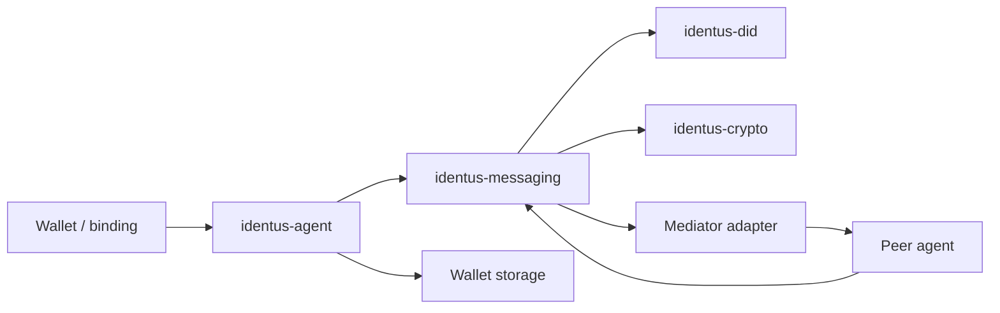

# DIDComm Protocol Architecture

This document records the initial `DIDComm` v2 protocol inventory for
`sdk-rust`. The first implementation slices add typed protocol identifiers,
message-envelope boundaries, Docker-free credential, proof, problem, trust
ping, revocation, mediation, pickup, and routing state-machine ports.
Pack/unpack and crypto routing remain adapter-level future tasks.

## Current Protocol Set

| Protocol | Canonical URI | Stage | Source evidence | Rust owner |
|---|---|---|---|---|
| Out-of-Band 2.0 | `https://didcomm.org/out-of-band/2.0` | Parity | Cloud Agent OOB/connection modules, docs specifications matrix | `identus-messaging` |
| BasicMessage 2.0 | `https://didcomm.org/basicmessage/2.0` | Parity | Mediator E2E tests and docs specifications matrix | `identus-messaging` |
| Trust Ping 2.0 | `https://didcomm.org/trust-ping/2.0` | Parity | Cloud Agent trust-ping, Mediator Discover Features | `identus-messaging` |
| Discover Features 2.0 | `https://didcomm.org/discover-features/2.0` | Parity | Mediator Discover Features and protocol tests | `identus-messaging` |
| Routing 2.0 | `https://didcomm.org/routing/2.0` | Parity | Cloud Agent routing, Mediator forwarding tests | `identus-messaging` |
| Coordinate Mediation 2.0 | `https://didcomm.org/coordinate-mediation/2.0` | Parity | Cloud Agent mediation, Mediator mediation tests | `identus-messaging` |
| Coordinate Mediation 3.0 | `https://didcomm.org/coordinate-mediation/3.0` | Roadmap | Docs matrix marks it as planned | `identus-messaging` |
| Message Pickup 3.0 | `https://didcomm.org/messagepickup/3.0` | Parity | Mediator pickup tests and docs matrix | `identus-messaging` |
| Issue Credential 3.0 | `https://didcomm.org/issue-credential/3.0` | Parity | Cloud Agent issue credential protocol | `identus-messaging` |
| Present Proof 3.0 | `https://didcomm.org/present-proof/3.0` | Parity | Cloud Agent present proof protocol | `identus-messaging` |
| Report Problem 2.0 | `https://didcomm.org/report-problem/2.0` | Parity | Cloud Agent report problem protocol and docs ADR | `identus-messaging` |
| Revocation Notification 1.0 | `https://didcomm.org/revocation-notification/1.0` | Parity | Identus revocation notification docs and integration matrix | `identus-messaging`, `identus-trust` |
| DID Exchange 1.0 | `https://didcomm.org/didexchange/1.0` | Compatibility | Cloud Agent connection compatibility | `identus-messaging` |
| Connections 1.0 | `https://didcomm.org/connections/1.0` | Compatibility | Cloud Agent invitation compatibility tests | `identus-messaging` |
| DID Rotate 2.0 | `https://didcomm.org/did-rotate/2.0` | Roadmap | DID rotation backlog and wallet continuity needs | `identus-messaging`, `identus-did` |

Compatibility aliases observed in existing material:

- `https://didcomm.org/pickup/3.0` maps to Message Pickup 3.0.
- `https://didcomm.org/mediator-coordination/2.0` maps to Coordinate Mediation
  2.0.
- Older `didexchange/1.0`, `connections/1.0`, OOB 1.0, issue-credential 1.0/2.0,
  and report-problem 1.0 inputs must be parsed for migration tests before they
  can be deprecated from SDK-facing compatibility layers.

## Typed Boundary

`identus-messaging` starts with these type-safe primitives:

- `DidCommMessageType`: validates
  `https://didcomm.org/{family}/{version}/{message}` and exposes family,
  version, message name, protocol URI, and protocol kind.
- `DidCommMessageId` and `DidCommThreadId`: reject empty, whitespace, and
  control-character identifiers.
- `DidCommPlaintextMessage`: holds typed id, type, sender DID, recipient DIDs,
  and thread references before serialization and pack/unpack are implemented.
- `DidCommProtocolProfile`: records the protocol catalog, stage, source
  evidence, known message names, and owning backlog task.
- `IssueCredentialStateMachine`: accepts proposal, offer, request, issue, and
  compatibility credential messages behind typed events.
- `PresentProofStateMachine`: accepts proposal, request, and presentation
  messages behind typed events.
- `ReportProblemStateMachine`: records `problem-report` messages behind a
  typed event.
- `TrustPingStateMachine`: accepts ping and ping-response messages behind typed
  events.
- `RevocationNotificationStateMachine`: records Identus `revoke` notifications
  behind a typed event.
- `MediationCoordinationStateMachine`: accepts mediation request, grant or
  deny, keylist update, keylist update response, keylist query, and keylist
  messages behind typed events.
- `MessagePickupStateMachine`: accepts status request, status, delivery
  request, messages received, and live-delivery change messages behind typed
  events.
- `MediatorRoutingStateMachine`: accepts routing `forward` messages behind a
  typed event boundary.

Unchecked strings are allowed only at parse/serialization edges. State machines,
adapters, and bindings must pass typed values internally.

## Dependency Policy

Candidate base crates discovered through Cargo:

| Crate | Current signal | Initial decision |
|---|---|---|
| `didcomm` | Apache-2.0, `sicpa-dlab/didcomm-rust`, UniFFI and testvector features | Evaluate for pack/unpack and fixture compatibility. |
| `didcomm-rs` | Apache-2.0, decentralized-identity implementation with raw crypto, resolve, and OOB features | Evaluate for spec vectors and resolver/crypto dependency shape. |
| `affinidi-messaging-didcomm` | Apache-2.0, DIDComm v2.1 implementation from Affinidi TDK | Evaluate for v2.1 support and messaging-core traits. |

No base crate is added to the core domain primitive slice. The first adapter
decision must compare transitive dependencies, WASM/mobile targets, resolver
hooks, cryptographic provider control, test vectors, and conformance coverage.
The initial decision record is
`docs/architecture/adr-didcomm-pack-unpack-dependency.md`.

## Runtime Relations

## First Implementation Plan

1. Land typed message type, id, thread id, protocol catalog, and plaintext
   envelope primitives.
2. Add transcript fixtures for OOB, Trust Ping, BasicMessage, mediation, pickup,
   issue credential, present proof, report problem, and revocation notification.
3. Evaluate base DIDComm crates for pack/unpack and crypto/resolver ownership.
4. Add connection and DID rotation state-machine ports with in-memory
   `identus-agent` tests once the compatibility fixtures are expanded.
5. Add transport adapters for embedded mediator queue, HTTP, WebSocket, mobile
   background delivery, and future Rust mediator service reuse.
