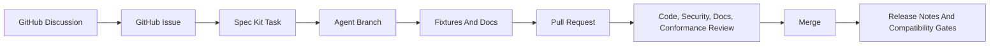

# Agentic SDLC

The `sdk-rust` SDLC is designed for multiple AI agents and human maintainers to
work in parallel without lowering code, documentation, security, or maintenance
quality. GitHub Issues hold actionable work, GitHub Discussions hold design
debate, Pull Requests hold reviewable changes, Spec Kit tasks hold acceptance
criteria, and conformance fixtures hold executable behavior.

## Goals

- Preserve Rust as the semantic core for Identus SDK behavior.
- Keep the repository understandable for humans and agents.
- Make status, ownership, acceptance criteria, and validation visible in GitHub.
- Prevent code-only changes from bypassing specification, docs, security, or
  conformance impact.
- Let agents work concurrently by owning small, independently reviewable tasks.

## Agent Roles

| Agent | Primary responsibility | Required handoff |
| --- | --- | --- |
| `manager` | Triage, prioritization, project status, user summaries | Issue assignment and PR status |
| `planner` | Spec Kit specs, plans, tasks, acceptance criteria | Ready implementation task |
| `engineer` | Code, fixtures, docs, validation, signed commits | Pull Request |
| `conformance` | Fixture schemas, parity inventories, transcript replay | Passing conformance harness |
| `reviewer` | Rust correctness, API shape, hexagonal boundaries | Review approval or requested changes |
| `security` | Crypto, storage, dependency, privacy, redaction review | Security approval or blocking finding |
| `docs` | Architecture, testing, migration, release docs | Docs approval |
| `release` | Version readiness, compatibility matrix, release notes | Release decision |
| `maintenance` | Label sync, stale work, automation drift, cleanup | Maintenance Issue or PR |

## Work Item Types

| Type | GitHub label | Required evidence |
| --- | --- | --- |
| Capability | `type:capability` | Spec Kit task, owner crate, fixture impact |
| Defect | `type:defect` | Reproduction, expected typed error, regression test |
| Conformance | `type:conformance` | Specification id, fixture family, expected runner |
| Architecture | `type:architecture` | Discussion link, ADR or plan update |
| Documentation | `type:docs` | Target docs and source evidence |
| Maintenance | `type:maintenance` | Harness, CI, labels, release, or cleanup impact |
| Security | `type:security` | Threat model, redaction, key, storage, or dependency impact |

## Issue Statuses

| Status | Label | Entry rule | Exit rule |
| --- | --- | --- | --- |
| Triage | `status:triage` | New Issue or converted Discussion | Manager assigns owner and type |
| Needs Spec | `status:needs-spec` | Behavior is not ready for code | Spec Kit task has acceptance criteria |
| Ready | `status:ready` | Task has owner, scope, and validation | Agent starts a branch |
| In Progress | `status:in-progress` | Agent is actively changing files | PR opened or work blocked |
| Blocked | `status:blocked` | Missing decision, dependency, or external state | Blocker resolved or task deferred |
| Review | `status:review` | PR is open and CI started | Reviewer approval or changes requested |
| Security Review | `status:security-review` | Code touches security-sensitive areas | Security approval or blocking finding |
| Docs Review | `status:docs-review` | User-facing behavior or architecture changed | Docs approval |
| Conformance | `status:conformance` | Fixture, parity, or protocol behavior changed | Harness passes |
| Ready To Merge | `status:ready-to-merge` | Required reviews and gates are green | Merge completed |
| Released | `status:released` | Change is included in release notes | Release notes and tag are published |

Only one active `status:*` label should be present on an Issue or PR. Automation
or a maintenance agent may correct drift.

## GitHub Project Fields

Use the repository Project as the shared board for agents:

| Field | Values |
| --- | --- |
| `Status` | The status names listed above |
| `Agent` | `manager`, `planner`, `engineer`, `conformance`, `reviewer`, `security`, `docs`, `release`, `maintenance` |
| `Capability` | `did`, `credential`, `presentation`, `didcomm`, `openid4vc`, `wallet`, `agent`, `trust`, `bindings`, `adapters`, `conformance`, `maintenance` |
| `Risk` | `low`, `medium`, `high`, `security-sensitive` |
| `Fixture Impact` | `none`, `vector`, `transcript`, `interop`, `static-model`, `infrastructure` |
| `Docs Impact` | `none`, `architecture`, `testing`, `migration`, `release` |

Project fields mirror labels where possible. Labels are the portable source of
truth; Project fields are the planning view.

## Discussion Workflow

GitHub Discussions are required before implementation when a change affects
public API shape, protocol interpretation, crate boundaries, security posture,
or cross-repository compatibility. Use Discussions for design tradeoffs and
Issues for accepted work.

Discussion lifecycle:

1. Open a Discussion with source evidence and concrete decision options.
2. Link any related legacy SDK, docs, integration, mediator, cloud-agent, or
   neoprism evidence.
3. Capture the accepted decision in an ADR, Spec Kit plan, or Issue.
4. Convert the accepted work into one or more Issues with acceptance criteria.
5. Link the Discussion from each resulting Issue and PR.

## Pull Request Workflow

Every PR must include:

- Linked Issue or administrative-change rationale.
- Summary of code, docs, fixtures, and harness changes.
- Validation commands and results.
- Security impact statement.
- Docs impact statement.
- Conformance or fixture impact statement.
- Confirmation that commits are GPG-signed and DCO-signed.

Required review lanes:

| Change | Required lane |
| --- | --- |
| Public API, crate layout, domain type | `reviewer` |
| Crypto, wallet storage, secrets, dependencies | `security` |
| Fixtures, protocol transcripts, parity manifests | `conformance` |
| Architecture, testing, migration, release docs | `docs` |
| Release metadata or compatibility gates | `release` |

## Harness

The local and CI harness has three purposes:

1. Verify repository governance files exist and include required SDLC terms.
2. Verify GitHub templates and labels preserve issue status and agent workflow.
3. Verify code, docs, fixtures, and generated artifacts still pass executable
   conformance checks.

Run the full local harness before PR handoff:

```bash
node tools/check-agent-sdlc.mjs --check
.specify/scripts/bash/check-prerequisites.sh --json --include-tasks
node tools/generate-wrapper-api-parity.mjs --check
node tools/generate-workspace-dependency-graph.mjs --check
cargo fmt --all -- --check
cargo clippy --workspace --all-targets -- -D warnings
cargo test --workspace
```

## Flow



## Sync Rules

- `status:*`, `type:*`, `area:*`, `agent:*`, and `risk:*` labels are defined
  in `.github/labels.yml`.
- Agent labels include `agent:manager`, `agent:planner`, `agent:engineer`,
  `agent:conformance`, `agent:reviewer`, `agent:security`, `agent:docs`,
  `agent:release`, and `agent:maintenance`.
- Issue templates must ask for owner crate, affected capability, acceptance
  criteria, conformance impact, docs impact, and discussion link.
- PR templates must ask for validation commands, security impact, docs impact,
  conformance impact, and linked work.
- Discussion templates must preserve architecture and research decisions before
  implementation.
- Spec Kit tasks remain the durable backlog. Discovered work must be added to
  `specs/001-sdk-rust-platform-core/tasks.md` in the same increment.

## Quality Bar

- Domain semantics remain in Rust crates.
- Bindings and adapters stay thin and depend on stable ports.
- Public names use SSI domain terminology.
- New identifiers use type-safe primitives instead of unchecked strings.
- Tests must prefer Docker-free fixtures and deterministic transcripts.
- Infrastructure tests are opt-in and must declare required services.
- Diagnostics must be redaction-safe and avoid secrets, claims, tokens, keys,
  or production identifiers.
