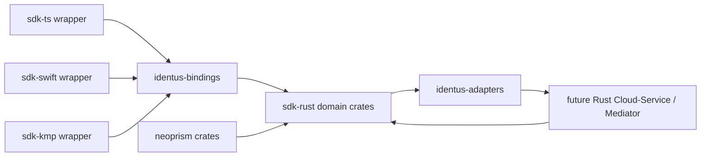

# Legacy SDK Migration Map

This map turns the current TypeScript, Swift, Kotlin Multiplatform, and
neoprism surfaces into an explicit `sdk-rust` replacement contract. It is based
on the local repositories under `repos/` and should be updated whenever a legacy
SDK adds a public module, test fixture, or externally documented behavior.

The goal is not to delete language SDKs. The goal is to move product semantics
into Rust crates, then expose thin TypeScript, Swift, Kotlin, WASM, Node, and
React Native wrappers over the same conformance fixtures.

Historical SDK codenames appear in this document only as source evidence for
existing packages and tests. New `sdk-rust` public surfaces must use SSI domain
names.

## Source Repositories

| Source | Public shape observed | Replacement role |
|---|---|---|
| `sdk-ts` | `@hyperledger/identus-edge-agent-sdk`, `@hyperledger/identus-domain`, wasm packages for `anoncreds`, `didcomm`, and `jwe` | Primary browser, Node, and React Native wrapper over Rust-owned semantics |
| `sdk-swift` | SwiftPM libraries `Domain`, `Apollo`, `Castor`, `Pollux`, `Mercury`, `Pluto`, `Builders`, `EdgeAgent`, `Authenticate`, `EdgeAgentSDK` | UniFFI/Swift wrapper plus iOS secure-storage and platform adapters |
| `sdk-kmp` | KMP `sdk` module for Android/JVM with Apollo, Castor, Pollux, Mercury, Pluto, EdgeAgent, plus end-to-end Cucumber features | UniFFI/Kotlin wrapper plus Android secure-storage and JVM adapters |
| `neoprism` | Rust crates `identus-apollo`, `identus-did-core`, `identus-did-prism`, `identus-did-prism-indexer`, `identus-did-prism-ledger`, `identus-did-prism-submitter`, `identus-did-resolver-http`, `node-storage` | Quality baseline and future source for PRISM DID, VDR, ledger, and storage modules |

## Module Migration Matrix

| Legacy capability | Evidence | Rust owner crate | Binding or adapter target | Parity proof |
|---|---|---|---|---|
| Shared domain DTOs and typed errors | `sdk-ts/packages/shared/domain/src/models`, `sdk-swift/EdgeAgentSDK/Domain`, `sdk-kmp/.../domain/models` | `identus-core` | `identus-bindings` DTOs for TS, Swift, Kotlin | Static model tests and golden JSON fixtures |
| Cryptography, key curves, signatures, BIP-39, restoration | `sdk-ts/.../apollo`, Swift `Apollo`, KMP `apollo`, neoprism `lib/apollo` | `identus-crypto` | WASM, Node, UniFFI, KMS and platform signer adapters | Deterministic key vectors, JWK/JOSE vectors, negative key tests |
| DID parsing, DID URL parsing, PRISM DID, peer DID | TS `castor`, Swift `Castor`, KMP `castor`, neoprism `did-core` and `did-prism` | `identus-did` | HTTP resolver and neoprism VDR adapters | PRISM deterministic vector, DID URL vectors, peer DID vectors |
| DIDComm pack/unpack and protocols | TS `mercury`, Swift `Mercury`, KMP `mercury` | `identus-messaging` | DIDComm transport adapters, embedded mediator, future Rust mediator | Transcript fixtures for OOB, connection, issue credential, present proof, mediation, pickup, routing |
| Credential parsing, requests, verification, SD-JWT, JWT VC, AnonCreds | TS `pollux`, Swift `Pollux`, KMP `pollux`, TS wasm `anoncreds` | `identus-credentials` and `identus-presentations` | Language wrapper format registry and optional AnonCreds adapter | Credential vectors, negative verification fixtures, presentation exchange vectors |
| Wallet storage, backup, DIDs, keys, messages, credentials | TS `pluto`, Swift `Pluto`, KMP `pluto` | `identus-wallet` | In-memory, SQLite, browser, iOS Keychain, Android Keystore adapters | Backup/restore fixtures and repository behavior tests |
| Agent orchestration and high-level DIDComm workflows | TS `edge-agent`, Swift `EdgeAgent`, KMP `edgeagent` | `identus-agent` for acceptance model, `identus-wallet` for production orchestration | TS, Swift, Kotlin facade packages | BDD-derived Rust acceptance tests without Docker by default |
| Connectionless OOB credential and proof flows | KMP feature files and OOB models, Swift edge-agent tests, TS agent tests | `identus-messaging`, `identus-agent` | QR/deep-link parser adapters | OOB transcript fixtures and embedded-agent acceptance tests |
| OID4VCI and OID4VP holder/issuer/verifier behavior | Docs, Cloud Agent BDD, Swift commented OpenID4VCI dependency, TS OIDC fixtures | `identus-openid4vc`, `identus-trust` | Browser redirect, mobile deep-link, HTTP adapters | OpenID4VC conformance entries and interop fixtures |
| Authentication challenge and deep-link helpers | Swift `Authenticate` target | `identus-openid4vc`, `identus-presentations`, `identus-bindings` | Swift and mobile wrapper helpers | Challenge/request fixtures and platform binding tests |
| Plugin extension points | TS `plugins` package | `identus-core` extension traits plus adapter registry | TS wrapper plugin compatibility layer | Static extension-contract tests |
| PRISM ledger indexing and submission | neoprism `did-prism-indexer`, `did-prism-ledger`, `did-prism-submitter` | `identus-did`, `identus-adapters` | Optional Cardano, Blockfrost, db-sync adapters | Infrastructure-gated VDR tests plus in-memory ledger tests |
| DID resolver HTTP service | neoprism `did-resolver-http` | `identus-adapters` | Future Cloud-Service and resolver sidecar | HTTP contract tests and OpenAPI compatibility checks |
| Node storage and service persistence | neoprism `node-storage`, legacy wallet stores | `identus-wallet`, `identus-adapters` | SQLite/Postgres adapters, mobile secure stores | Storage migration vectors and backup compatibility tests |

## Migration Relations

## Parity Gates

Before a legacy module can be called replaced, the Rust owner must satisfy all
of these gates:

1. The public behavior has at least one conformance entry or BDD acceptance
   scenario linked to a backlog task.
2. The Rust crate owns the model or state machine behind a stable API.
3. The language wrapper exposes only DTO conversion, platform I/O, or ergonomic
   facade code.
4. Existing TS, Swift, and KMP fixtures either pass against the Rust core or are
   represented as documented skip rows with rationale.
5. Mobile, browser, and Node targets have explicit storage, signer, and transport
   adapter decisions before the wrapper is declared stable.

## Near-Term Backlog Additions

| Task | Deliverable | Reason discovered |
|---|---|---|
| T053 | Add a machine-readable migration manifest that mirrors this table and can be consumed by conformance tests | The replacement plan needs an executable inventory, not only Markdown |
| T054 | Add wrapper API parity inventories for TS, Swift, and Kotlin packages | Public exports differ by language and need per-wrapper gate files |
| T055 | Add neoprism convergence ADR for crate reuse, crate moves, and service thinning | neoprism already owns Rust PRISM/DID/VDR code that should not be reimplemented blindly |
| T056 | Add platform secure-storage ADR for browser, Node, iOS, Android, JVM, and server stores | Wallet storage behavior is platform-specific and must be normalized before bindings stabilize |
| T057 | Add plugin and extension compatibility ADR for the TS plugin surface | TS plugins are a visible extension point with no direct Rust mapping yet |
